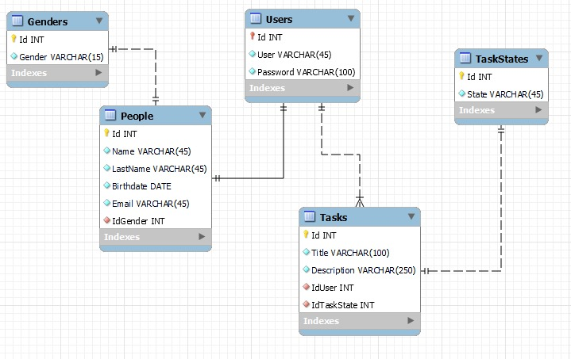

# Indicaciones generales

En el archivo '.env.example' se encuentra un ejemplo de cómo debe verse el archivo '.env' para la configuración del entorno virtual.

Para el correcto funcionamiento del proyecto, renombrar el archivo '.env.example' por '.env' y cambiar los valores que sean necesarios.

- Para iniciar el proyecto: 
    1. Clonar el repositorio: git clone https://github.com/kmilom/back.git
    2. Entrar en el directorio: cd back
    3. Instalar dependencias: npm install
    4. Iniciar el proyecto: npm run dev

**Nota:** Este proyecto fue desarrollado con node v18.18.0 y npm v10.8.3

# Base de datos

- A continuación, diagrama entidad-relación de la base de datos:

- Dentro de la carpeta 'dbdocs' se encuentran los siguientes archivos:
1. `scriptsdb.txt`: Contiene las consultas SQL para insertar registros básicos en las tablas `genders` y `taskstates`, lo que permite una configuración inicial rápida de la base de datos.
2. `todolist.mwb`: Contiene el diagrama entidad-relación de la base de datos compatible con la herramienta MySQL Workbench para la creación y administración de la base de datos.
3. `todolistdb.sql`: Contiene el Script sql proporcionado como alternativa para la creación de la base de datos. 

# Librerías del proyecto

A continucación se encuentran las librerías usadas en el proyecto y sus respectivos comandos de instalación:

1. nodemon y express: npm i express nodemon
2. dotenv: npm i dotenv -D
3. mysql: npm i mysql
4. morgan: npm i morgan
5. cors: npm i cors
6. Bcryptjs: npm i bcryptjs
7. JSONWebToken: npm i jsonwebtoken

**Nota:** Estas librerías no es necesario instalarlas, debido a que esto se hará automáticamente al seguir los pasos descritos en las indicaciones generales.